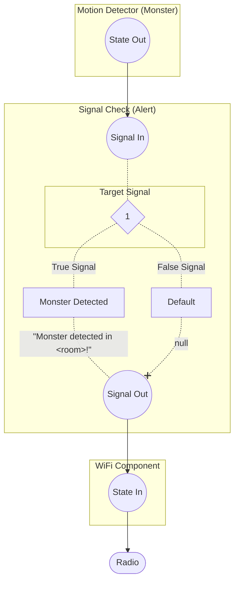
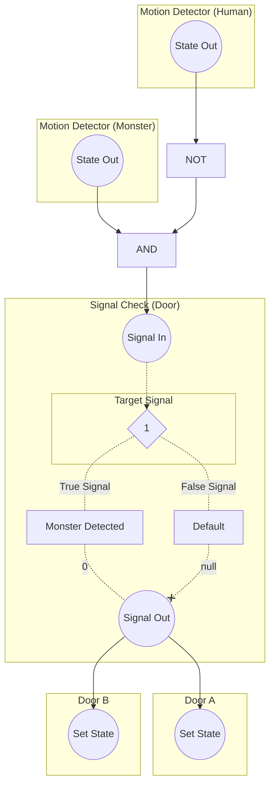
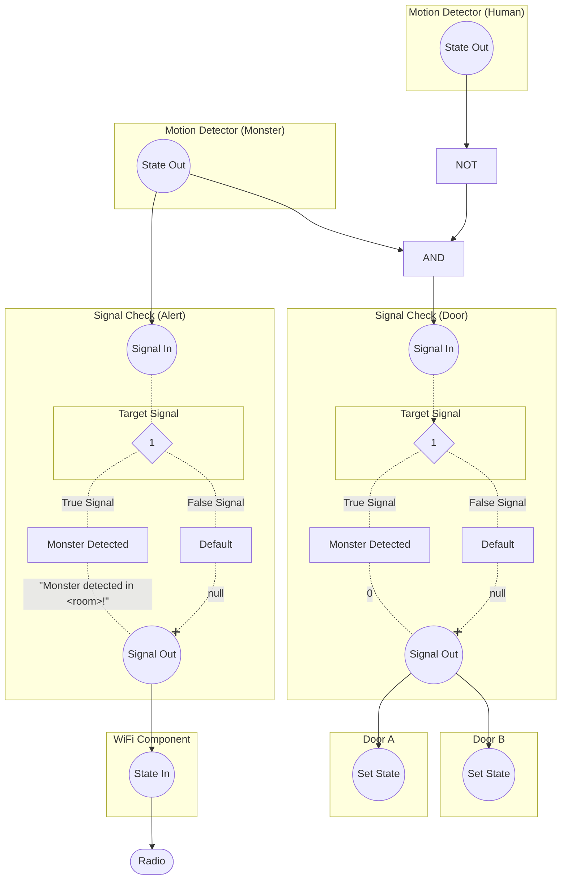

# Monster Detection System

## Problem

When monsters get into the sub, it's hard to keep track of where they are. Radio traffic
becomes chaotic as we try to juggle repairing hull breaches with calling out monster locations.
It would be very helpful to dispatch security without requiring interruption to operations.

## Proposed Solution

We can automate the detection of monsters. Motion detector components can be configured to only
detect monsters. This, combined with WiFi components, can directly output the location of a detected
monster to our comms.

This diagram represents a single circuit for a single motion detector. The circuit is incredibly
basic because it isn't required to talk to any centralized logic. The circuit only executes on state
change from the motion detector.

Additionally, these circuits can be retrofitted with an additional branch to lock doors leading out
of the installation's room. This limits the mobility of monsters, hopefully keeping crewmates out of
harm, and limiting the monster's mobility out of the room. This allows security to track them more
efficiently.

We also want to ensure that, if humans are in the same room as the monster, they are free to leave
the room. As such, an additional motion detector is required for that signal.

There are a number of ways to accomplish this, such as a RegEx component using the output from the
alert signal, but they all require a single additional component, and using another signal check
component makes the purpose of this circuit clearer.

When we combine the circuits, it looks like this:

### Bill of Materials

* **Alert Circuit**
    * Motion Detector x1
        * FPGA x1
        * Silicon x1
    * Signal Check Component x1
        * FPGA x1
        * Tin x1
    * WiFi Component x1
        * FPGA x1
        * Tin x1
    * Wire x2
* **Door Circuit**
    * Motion Detector x1
        * FPGA x1
        * Silicon x1
    * NOT Component x1
        * FPGA x1
        * Tin x1
    * AND Component x1
        * FPGA x1
        * Tin x1
    * Signal Check Component x1
        * FPGA x1
        * Tin x1
    * Wire x5 (+1 for each additional door)

### Plan

Each room and/or area will have its own independent circuit. There is no need to hook the circuits
up to any centralized logic, as they simply output directly to chat and control their own doors.
Each circuit has a unique message, so there's no need to do any parsing and concatenation.

#### Room Priority (Sorted)

* Ballast tanks
    * Outer wall
    * Extremely critical components
        * How many do we need to be operational at a time?
* Engine room
    * Outer wall
    * Critical component
    * Often no people inside
* Mechanical room
    * Outer wall
* Stowage
    * Outer wall
    * Raptors can ambush doctors
    * Often no people inside
* Bottom docking port
    * Outer wall
    * Raptors have to move through mechanical
    * Often no people inside
    * Often no people inside
* Central access passages/shafts
    * Two direct access points to outer wall
    * Critical for movement about the ship
* Crew Quarters (Top)
    * Outer wall
    * Monsters can ambush doctors
    * Often no people inside
* Airlock, Upper Mid, Upper Docking Port, Upper Fore
    * Huge attack surface on outer wall
    * Water has to flow to the bottom of the ship to pump out
    * Diving suits are up there
* Armory
    * Outer wall
    * Weapons located there
        * Security people: does this matter?
    * Often no people inside
* Mid fore side
    * Very protected
    * Situationally critical components
    * Heavily populated (alerts may not be necessary)
* Command room
    * Heavily populated (alerts may not be necessary)
    * Critical components (Paddy)
* Crew quarters (Bottom)
    * Outer wall
    * Usually empty
    * Shares two walls with ballast tanks
* Reactor room
    * Critical components
        * It could be ok if the room fills with water, as long as people are nearby
    * Highly protected
    * Heavily populated (alerts may not be necessary)
* Electrical
    * Extremely critical components
    * Outer wall
    * Disaster if it fills with water
    * Heavily populated (alerts may not be necessary)

## Open Questions

1. How do we balance alerts for high priority rooms vs door locking? Both cost materials. Do we want
   to implement alerts in all rooms and then implement doors? Or do we want to implement them in
   parallel? Something else?
2. Is the room priority correct? I would like security, mechanics, and the captain to weigh in.
3. Is there any other information we could provide to security that would help? I considered an
   alert light and/or alarm buzzer, but I didn't think that would be very helpful as an addition to
   the radio message.